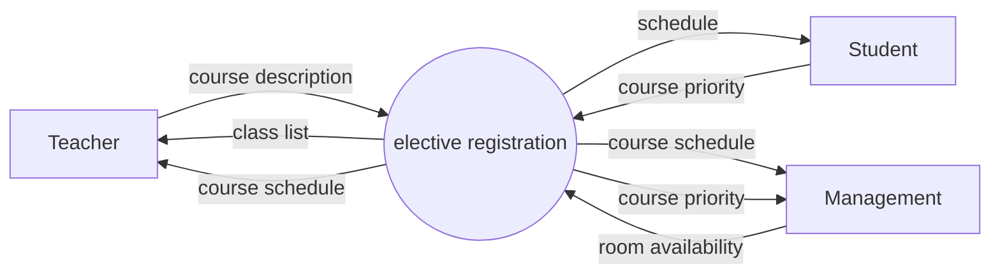
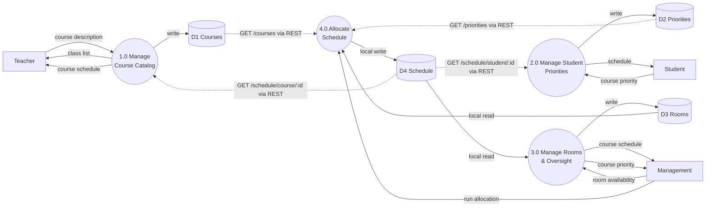
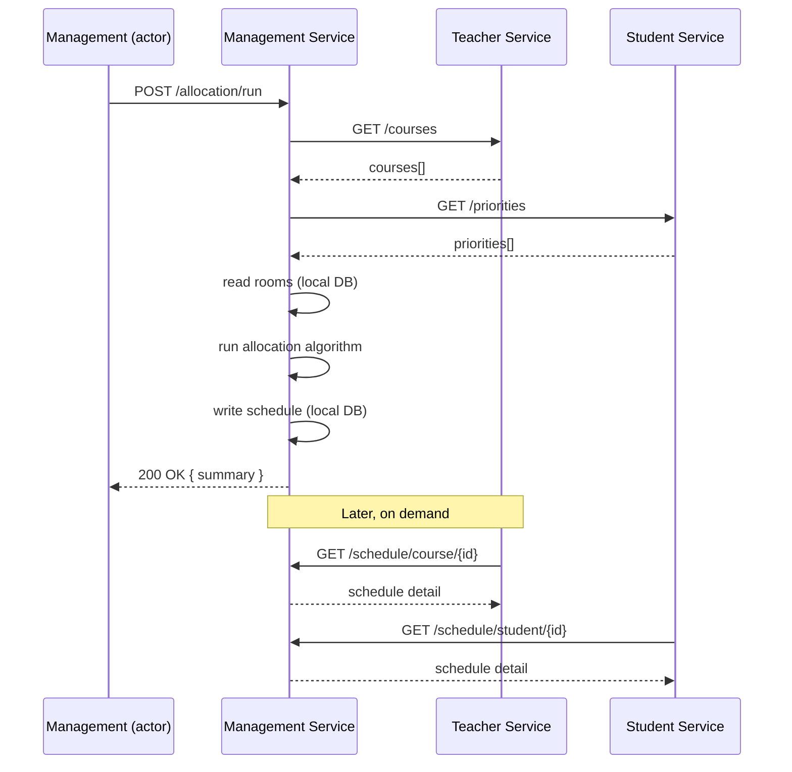
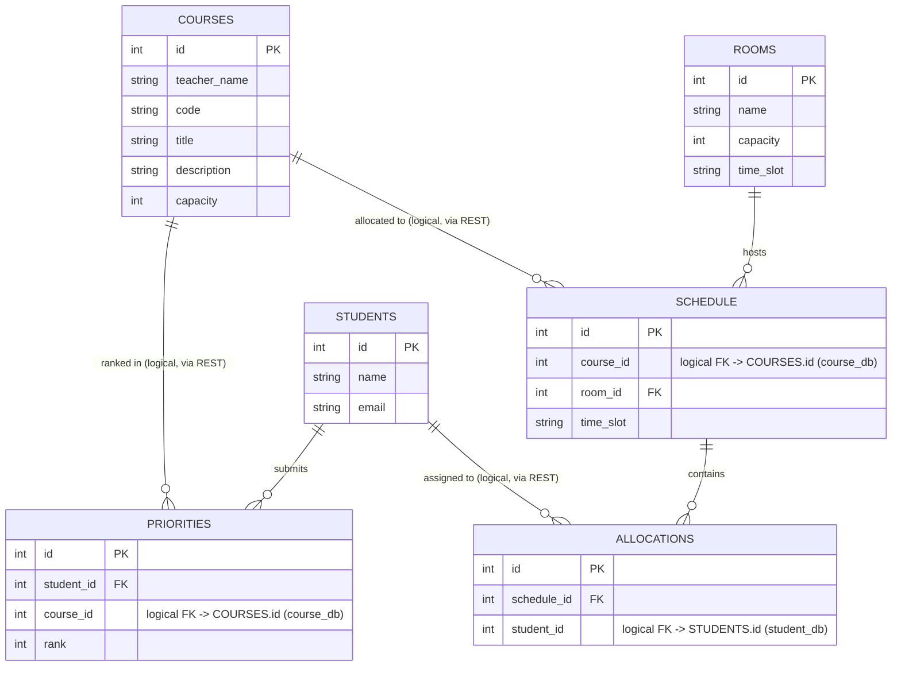
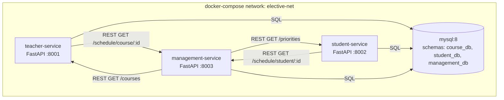

# Elective Course Registration — Design Document (MVP)

## 1. Purpose & Scope

A minimal demo of an elective course registration system, decomposed into three
independently deployable services — one per external actor from the context
diagram — that collaborate over REST to allocate students to elective courses.

This document covers:

- Recap of the Level 0 context diagram
- Level 1 data flow diagram (process decomposition)
- Service & API boundaries
- Cross-service interaction (allocation sequence)
- Data model per service
- Deployment architecture (docker-compose)
- MVP simplifications and next steps

## 2. Actors (from context diagram)

| Actor      | Provides                         | Receives                        |
|------------|-----------------------------------|----------------------------------|
| Teacher    | course description                 | class list, course schedule     |
| Student    | course priority                    | schedule                        |
| Management | room availability                  | course schedule, course priority |

## 3. Context Diagram (Level 0) — recap



## 4. Service Decomposition Overview

The single "elective registration" process is split **by actor** into three
services, plus one internal process (the allocation engine) that lives inside
the Management Service because Management is the actor that triggers it and
consumes its output for oversight.

| # | Process                              | Owning service     |
|---|---------------------------------------|---------------------|
| 1.0 | Manage Course Catalog                | Teacher Service      |
| 2.0 | Manage Student Priorities             | Student Service      |
| 3.0 | Manage Rooms & Oversight               | Management Service   |
| 4.0 | Allocate Schedule (matching engine)    | Management Service (internal) |

## 5. Level 1 Data Flow Diagram

### 5.1 Data stores

| Store | Contents                           | Owned by            |
|-------|-------------------------------------|----------------------|
| D1    | Courses (catalog)                   | Teacher Service DB   |
| D2    | Priorities (student course rankings)| Student Service DB   |
| D3    | Rooms (availability/capacity)       | Management Service DB|
| D4    | Schedule (allocation results)       | Management Service DB|

### 5.2 Diagram



Dashed arrows (`-.->`) cross a service boundary and are implemented as REST
calls; solid arrows within the same service are local DB reads/writes.

### 5.3 Data flow descriptions

| # | Flow                          | From → To                        | Mechanism |
|---|--------------------------------|-----------------------------------|-----------|
| 1 | course description              | Teacher → 1.0                     | REST (external) |
| 2 | class list                      | 1.0 → Teacher                     | REST (external) |
| 3 | course schedule                 | 1.0 → Teacher                     | REST (external) |
| 4 | course priority                 | Student → 2.0                     | REST (external) |
| 5 | schedule                        | 2.0 → Student                     | REST (external) |
| 6 | room availability               | Management → 3.0                  | REST (external) |
| 7 | course schedule (report)        | 3.0 → Management                  | REST (external) |
| 8 | course priority (report)        | 3.0 → Management                  | REST (external) |
| 9 | run allocation                  | Management → 4.0                  | REST (external, triggers internal job) |
| 10 | courses (read)                 | D1 → 4.0                          | REST, Management Service → Teacher Service |
| 11 | priorities (read)               | D2 → 4.0                          | REST, Management Service → Student Service |
| 12 | rooms (read)                    | D3 → 4.0                          | local DB read |
| 13 | schedule (write)                | 4.0 → D4                          | local DB write |
| 14 | schedule detail (read)          | D4 → 1.0                          | REST, Teacher Service → Management Service |
| 15 | schedule detail (read)          | D4 → 2.0                          | REST, Student Service → Management Service |

## 6. Service & API Design

Each service is a small FastAPI app with automatic OpenAPI docs at `/docs`,
which doubles as the actor-facing UI for this MVP (no separate frontend).

### 6.1 Teacher Service (port 8001, schema `course_db`)

| Method | Path                          | Purpose |
|--------|--------------------------------|---------|
| POST   | `/courses`                     | Submit a course description |
| GET    | `/courses`                     | List all courses (also used by Management Service) |
| GET    | `/courses/{id}/class-list`     | Class list — calls Management `GET /schedule/course/{id}` |
| GET    | `/courses/{id}/schedule`       | Course schedule — calls Management `GET /schedule/course/{id}` |

### 6.2 Student Service (port 8002, schema `student_db`)

| Method | Path                              | Purpose |
|--------|-------------------------------------|---------|
| POST   | `/students`                        | Register a student |
| POST   | `/students/{id}/priorities`        | Submit ranked course priorities |
| GET    | `/priorities`                      | List all priorities (used by Management Service) |
| GET    | `/students/{id}/schedule`          | Assigned schedule — calls Management `GET /schedule/student/{id}` |

### 6.3 Management Service (port 8003, schema `management_db`)

| Method | Path                          | Purpose |
|--------|--------------------------------|---------|
| POST   | `/rooms`                        | Submit room availability |
| GET    | `/rooms`                        | List rooms |
| POST   | `/allocation/run`               | Trigger the allocation engine (4.0) |
| GET    | `/schedule`                     | Full schedule (management oversight view) |
| GET    | `/schedule/course/{id}`         | Schedule detail for one course (called by Teacher Service) |
| GET    | `/schedule/student/{id}`        | Schedule detail for one student (called by Student Service) |
| GET    | `/priorities-summary`           | Aggregated demand per course vs. capacity (management report) |

## 7. Cross-Service Interaction — Allocation Sequence



## 8. Data Model (per service)

**Teacher Service — `course_db`**
```
courses(id, teacher_name, code, title, description, capacity)
```

**Student Service — `student_db`**
```
students(id, name, email)
priorities(id, student_id, course_id, rank)
```

**Management Service — `management_db`**
```
rooms(id, name, capacity, time_slot)
schedule(id, course_id, room_id, time_slot)
allocations(id, schedule_id, student_id)
```

## 9. Entity-Relationship Diagram

All tables live in one MySQL instance but are split across three schemas
(one per service). Relationships **within** a schema are real foreign keys;
relationships **across** schemas (dashed in the diagram below, dotted-style
labels) are logical references only — validated at the application layer via
REST calls, not enforced by the database. This keeps each service's schema
independently owned, so the shared instance could be split into three
physical databases later without changing any table.



| Schema           | Tables                          |
|------------------|-----------------------------------|
| `course_db`      | COURSES                           |
| `student_db`     | STUDENTS, PRIORITIES              |
| `management_db`  | ROOMS, SCHEDULE, ALLOCATIONS       |

## 10. Allocation Algorithm (MVP default)

**Priority-first-fit**: process students in registration order; for each
student, assign them to their highest-ranked course that still has free
capacity (bounded by the room's capacity for that course's time slot).
Unmatched priorities are simply skipped. This is easy to explain/demo and can
be swapped for a fairer/optimizing algorithm later without changing the API
contracts.

## 11. Deployment Architecture



`docker-compose.yml` will define 4 containers: `teacher-service`,
`student-service`, `management-service`, and `mysql`, all on one bridge
network, with each app service reading its DB connection string (including
schema name) from environment variables.

## 12. MVP Simplifications / Non-Goals

- No authentication/authorization — any actor can call any endpoint.
- No message broker — all cross-service calls are synchronous REST.
- Single MySQL instance shared by all three services (three schemas, not
  three DB containers) — acceptable for a demo; a production system would
  give each service its own DB instance.
- No retry/circuit-breaker logic on cross-service REST calls.
- Allocation algorithm is intentionally simple (see §10), not an optimizer.
- No real frontend — FastAPI's `/docs` (Swagger UI) is the actor interface.

## 13. Next Steps (implementation plan)

1. Scaffold repo: `teacher-service/`, `student-service/`, `management-service/`,
   shared `docker-compose.yml`, MySQL init scripts (create 3 schemas).
2. Implement Management Service first (rooms, schedule tables, allocation
   engine) since the other two depend on its `/schedule/*` endpoints.
3. Implement Teacher Service (courses CRUD + proxy calls to Management).
4. Implement Student Service (students/priorities CRUD + proxy calls to
   Management).
5. Wire up `docker-compose.yml`, smoke-test the full allocation flow end to
   end via the sequence in §7.
