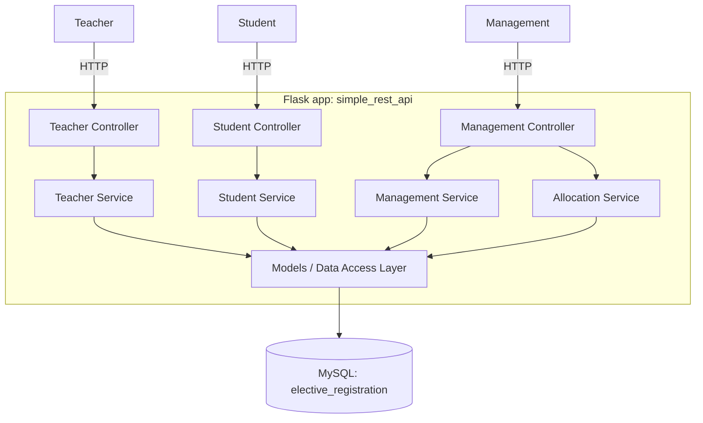
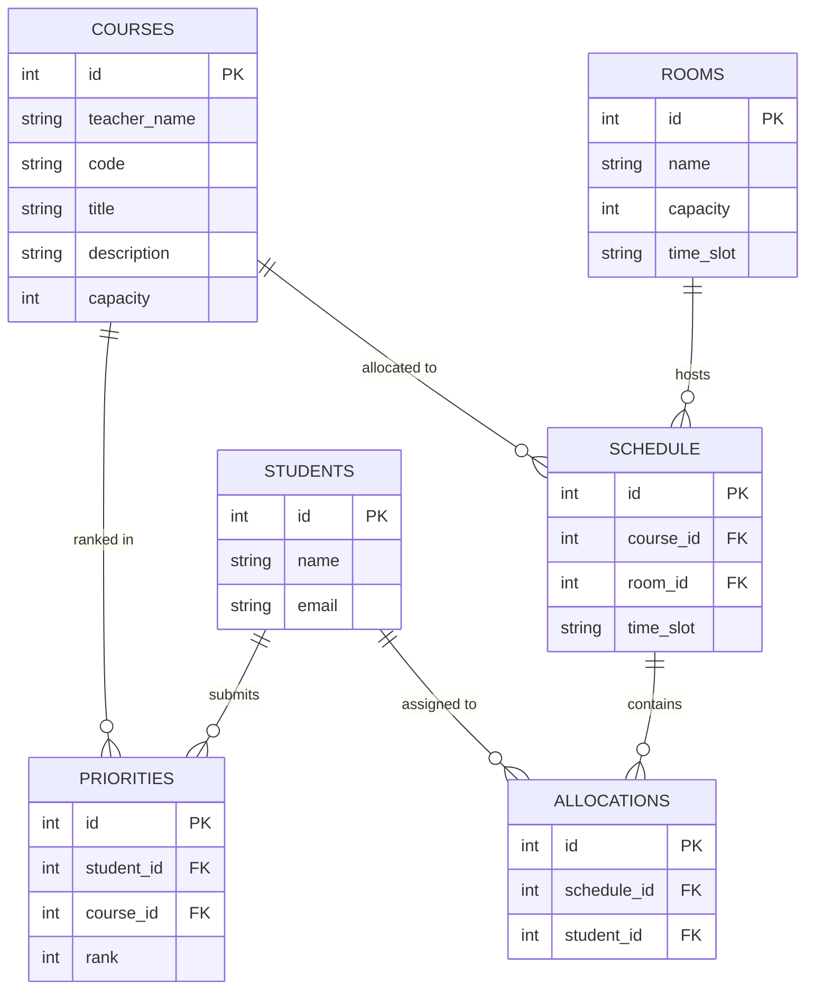
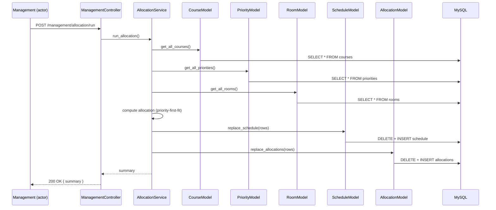

# Elective Course Registration — Simple REST API (MVC Monolith) Design

## 1. Purpose & Scope

Same domain as the microservices version at the repo root (see
[../docs/DESIGN.md](../docs/DESIGN.md)), but built as a **single Flask
application** using **MVC-style layering** (Controller → Service → Model)
against **one shared MySQL database**, accessed with `mysql-connector-python`
(raw SQL, no ORM). No containers — runs as one local Python process.

This exists alongside the microservices version deliberately, to demonstrate
two different architectural styles for the same requirements:

| Aspect               | Microservices (repo root)             | Simple REST API (this folder)         |
|-----------------------|-----------------------------------------|-----------------------------------------|
| Process count          | 3 independent processes                 | 1 process                               |
| Framework               | FastAPI × 3                             | Flask                                   |
| DB access                | SQLAlchemy ORM                          | `mysql-connector-python` (raw SQL)      |
| Database                  | 1 MySQL instance, 3 schemas (1/service) | 1 MySQL instance, 1 shared schema       |
| Cross-entity references    | Logical only (validated via REST)       | Real foreign keys (single schema)       |
| Communication between parts | REST over HTTP, between services        | In-process function calls               |
| Deployment                    | docker-compose, 4 containers            | Single Python process, no containers    |
| Architectural pattern           | Service-per-actor microservices         | Layered MVC monolith                    |

The actors, data flows, and allocation logic are unchanged from the context
diagram and Level 1 DFD already documented at the root — only the
architecture changes.

## 2. Architecture Overview



- **Controllers** (Flask Blueprints) parse HTTP requests, call a service, and
  serialize the response. No business logic or SQL here.
- **Services** hold business logic, including the allocation algorithm.
  Because everything is in one process, a service can call any model
  directly — there's no network boundary to route around.
- **Models** are the data-access layer: one module per table, each wrapping
  plain SQL via `mysql-connector-python` and returning dicts. No SQL lives
  outside this layer.
- **One shared database** (`elective_registration`) holds all six tables.
  Since there's no service boundary, relationships that were "logical only"
  in the microservices version (e.g. a priority pointing at a course) are now
  **real foreign keys**.

## 3. Folder / Module Structure

```
simple_rest_api/
├── DESIGN.md
├── README.md
├── requirements.txt
├── schema.sql                  # single-schema DDL, run once against MySQL
├── app.py                      # Flask app factory + blueprint registration
├── config.py                   # DB connection settings (env-driven)
├── db.py                       # mysql-connector connection pool helper
├── controllers/
│   ├── teacher_controller.py
│   ├── student_controller.py
│   └── management_controller.py
├── services/
│   ├── teacher_service.py
│   ├── student_service.py
│   ├── management_service.py
│   └── allocation_service.py
└── models/
    ├── course_model.py
    ├── student_model.py
    ├── priority_model.py
    ├── room_model.py
    ├── schedule_model.py
    └── allocation_model.py
```

## 4. API Endpoints

Same operations as the microservices version, now behind one Flask app on a
single port, grouped by actor via Blueprint URL prefixes for clarity.

**Teacher Controller** (`/teacher`)
| Method | Path                              | Purpose |
|--------|-------------------------------------|---------|
| POST   | `/teacher/courses`                  | Submit a course description |
| GET    | `/teacher/courses`                  | List all courses |
| GET    | `/teacher/courses/<id>/class-list`  | Class list for a course |
| GET    | `/teacher/courses/<id>/schedule`    | Schedule for a course |

**Student Controller** (`/student`)
| Method | Path                                    | Purpose |
|--------|-------------------------------------------|---------|
| POST   | `/student/students`                       | Register a student |
| POST   | `/student/students/<id>/priorities`       | Submit ranked course priorities |
| GET    | `/student/students/<id>/schedule`         | Assigned schedule |

**Management Controller** (`/management`)
| Method | Path                              | Purpose |
|--------|-------------------------------------|---------|
| POST   | `/management/rooms`                 | Submit room availability |
| GET    | `/management/rooms`                 | List rooms |
| POST   | `/management/allocation/run`        | Trigger the allocation engine |
| GET    | `/management/schedule`              | Full schedule (oversight view) |
| GET    | `/management/priorities-summary`    | Demand vs. capacity per course |

## 5. Entity-Relationship Diagram

All six tables live in **one** schema, so every relationship is a real,
database-enforced foreign key — unlike the microservices version, which had
to treat cross-service references as logical-only.



## 6. Allocation Sequence (in-process, no REST)

Same priority-first-fit algorithm as the microservices version (§9 of the
root design doc), but every step is a direct function call within one
process instead of an HTTP round-trip.



## 7. MVP Simplifications / Non-Goals

- No authentication/authorization.
- No ORM — raw SQL via `mysql-connector-python`, hand-written in the model
  layer. No migrations tool; schema changes mean editing `schema.sql`.
- Single MySQL connection pool shared by all models.
- Allocation algorithm intentionally simple (priority-first-fit), matching
  the microservices version so behavior is comparable.
- No containers — run directly with a local Python venv and a local/remote
  MySQL server reachable from your machine.

## 8. Next Steps (implementation plan)

1. `schema.sql` — single `elective_registration` schema, 6 tables, real FKs.
2. `db.py` / `config.py` — connection pool + env-driven config.
3. Models — one module per table, plain functions returning dicts.
4. Services — `teacher_service`, `student_service`, `management_service`,
   and `allocation_service` (ports the priority-first-fit logic to operate
   on local model calls instead of REST responses).
5. Controllers — Flask Blueprints wiring HTTP routes to services.
6. `app.py` — app factory registering all three blueprints.
7. `requirements.txt` (`flask`, `mysql-connector-python`) and a `README.md`
   with local MySQL setup + run instructions (`python app.py`, port 5000).
